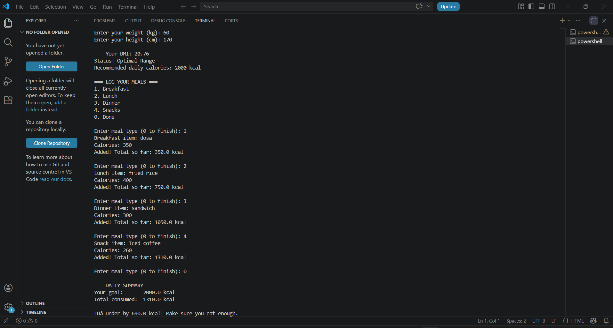

# CalTrack 🏃‍♂️💪
### A Personal Calorie & Fitness Tracker — Built in C

CalTrack is a console-based fitness tool that helps you 
understand your body and manage your daily nutrition. 
Built entirely in C using structured programming concepts.

---

## 🎯 Features
- **BMI Calculator** — Enter your height and weight to 
  instantly calculate your Body Mass Index
- **Personalized Calorie Goals** — Recommends daily calorie 
  targets based on your BMI category
- **Meal Logger** — Log meals across Breakfast, Lunch, 
  Dinner and Snacks with calorie counts
- **Running Total** — See your total calories consumed 
  after every meal entry
- **Smart Warnings** — Alerts you if you exceed or fall 
  short of your daily calorie goal

---

## 🏋️ BMI Categories
| BMI Range | Status | Daily Calorie Goal |
|-----------|--------|-------------------|
| Below 18.5 | Building Phase | 2500 kcal |
| 18.5 - 24.9 | Optimal Range | 2000 kcal |
| 25 and above | Wellness Journey | 1500 kcal |

---

## 🚀 How to Run

### Requirements
- GCC Compiler (MinGW for Windows)

